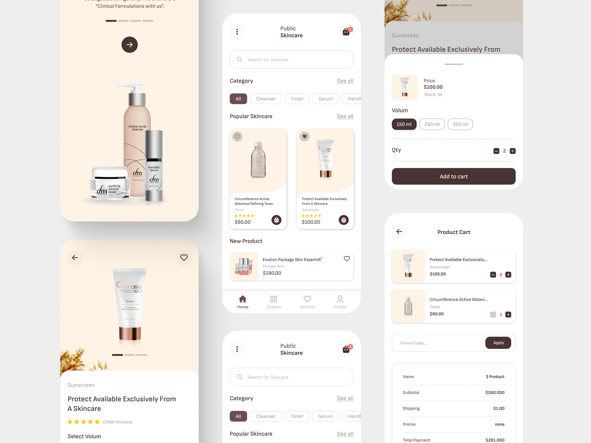

# Skincare App

Skincare App is an Android application built with Kotlin and Jetpack Compose that allows users to
browse and purchase skincare products.

## Features

- [x] **Onboarding**: Introduce users to the app with a seamless onboarding experience.
- [x] **User Authentication**: Register and login to manage orders and preferences.
- [x] **Browse Products**: View a catalog of skincare products.
- [x] **Product Details**: Get detailed information about each product.
- [x] **Add to Cart**: Add products to the shopping cart.
- [ ] **Checkout**: Complete the purchase process.

## Technologies Used

- **Kotlin**: Primary programming language.
- **Jetpack Compose**: Modern UI toolkit for building native Android UIs.
- **Coroutines**: Asynchronous programming.
- **Hilt**: Dependency injection framework.
- **DataStore**: Data storage solution for small amounts of data.
- **Navigation Compose**: For navigating between screens (Composables).

## Project Structure

- `skincare`: Main application module.
- `data`: Domain, repositories and Data sources.
- `common`: Small common features like preferences management.

## Installation

1. Clone the repository
2. Open the project in Android Studio.
3. Build and run the app on an Android emulator or device.

## Contributing

Contributions are welcome! If you'd like to contribute to this project, please follow these steps:

1. Fork the repository.
2. Create a new branch.
3. Make your changes and commit them.
4. Push to the branch.
5. Submit a pull request.

## Contact

For any inquiries or feedback, please
contact [rajdaouizouhir.pro@gmail.com](mailto:rajdaouizouhir.pro@gmail.com).

